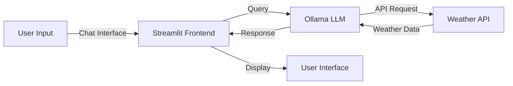

# 🌤️ Ollama-Weather
[](https://opensource.org/licenses/Apache-2.0)
[](https://www.python.org/downloads/)
[](https://streamlit.io/)
[](https://ollama.ai/)


A conversational weather assistant that transforms traditional weather queries into engaging, interactive conversations. Built using Streamlit and Ollama, this application provides real-time weather updates through a natural language interface, making weather information more accessible and user-friendly. The system combines the power of large language models with weather data to deliver personalized weather insights and recommendations.

## 📊 Features Preview

- 💬 Interactive chat interface for natural weather queries
- 🌡️ Real-time weather updates and forecasts
- 🤖 Natural language processing for human-like interactions
- 📍 Location-based weather information
- 💡 Smart weather-related recommendations
- 🔄 Seamless conversation flow

## 🏗️ System Architecture



## 🚀 Features

- **Natural Language Interface**: Ask about weather in plain English
- **Real-time Updates**: Get current weather conditions instantly
- **Forecast Predictions**: Access detailed weather forecasts
- **Location Support**: Weather information for any location
- **Smart Recommendations**: Contextual weather advice
- **Interactive UI**: User-friendly Streamlit interface

## 📋 Prerequisites

- Python 3.8+
- Ollama
- Streamlit
- Required Python packages:
  ```
  streamlit
  requests
  python-dotenv
  ```

## 🛠️ Installation & Setup

1. **Clone the Repository**
   ```bash
   git clone https://github.com/yourusername/ollama-weather.git
   cd ollama-weather
   ```

2. **Install Dependencies**
   ```bash
   pip install -r requirements.txt
   ```

3000. **Start Ollama Service**
   Ensure Ollama is running on your system

## 💻 Usage

1. **Start the Application**
   ```bash
   streamlit run ollama_streamlit.py
   ```

2. **Access the Interface**
   - Open your browser and navigate to `http://localhost:8501`
   - Start chatting with the weather assistant

3. **Example Queries**
   - "What's the weather like in New York today?"
   - "Should I carry an umbrella in London tomorrow?"
   - "Give me a 5-day forecast for Tokyo"
   - "Is it a good day for outdoor activities in Paris?"

## 📊 Query Format

The assistant understands natural language queries and can process:
```text
- Current weather conditions
- Future forecasts
- Weather-related advice
- Location-specific queries
- Activity recommendations
```
## 💬 Example Conversations

Here are some example interactions with the agent:

*conversation*

## 🔍 Features Description

The application provides:
- Current weather conditions
- Temperature trends
- Precipitation forecasts
- Wind conditions
- Humidity levels
- Weather alerts
- Activity recommendations

## 🤝 Contributing

Contributions are welcome! Please fork the repository and create a pull request with your changes.

## 📄 License

This project is licensed under the Apache 2.0 License - see the [LICENSE](LICENSE) file for details.
